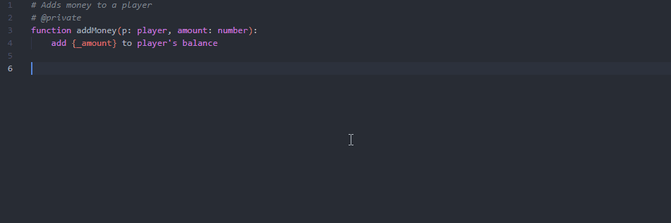
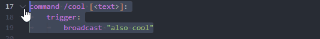
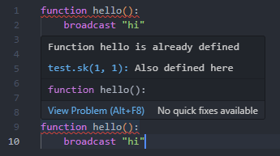
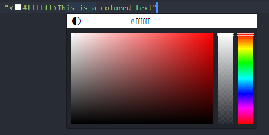
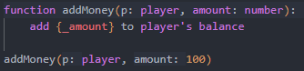

# Skript Autocompletions

Skript Autocompletes is a Visual Studio Code Extension that makes writing Minecraft Skript easier. The extension is not fully done yet so there may be bugs, if so please report them to me.

## Features

* Function autocompletions
* Function argument help
* Function argument inlay hints (off by default)
* Function goto definition
* Works across files
* Private functions for autocompletion
* Multi-line toggle comment (ALT+A)
* Built-in colorpicker
* Basic diagnostics
* Snippets
* Supports multi-root workspaces
* More coming soon...

## Install
* Download the extension [here](https://marketplace.visualstudio.com/items?itemName=Ezzenix.skript-autocompletions) or from the extensions tab directly.

## Preview

	</img>
	</img>
	</img>
	</img>
	</img>

